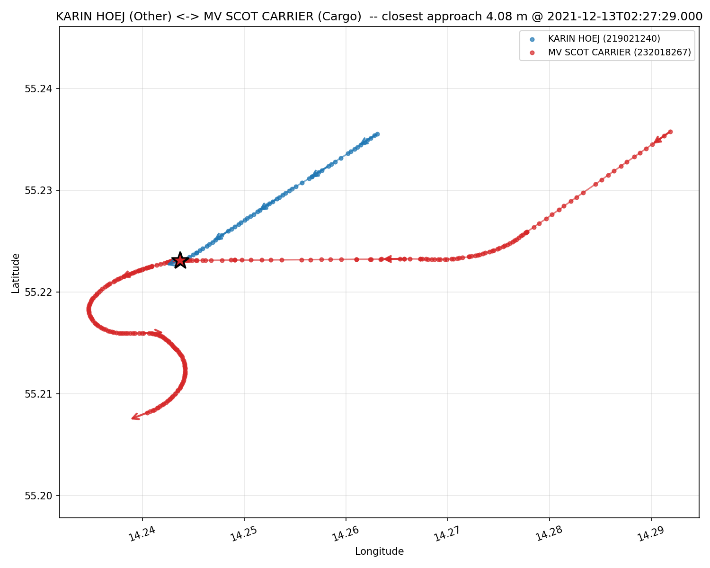
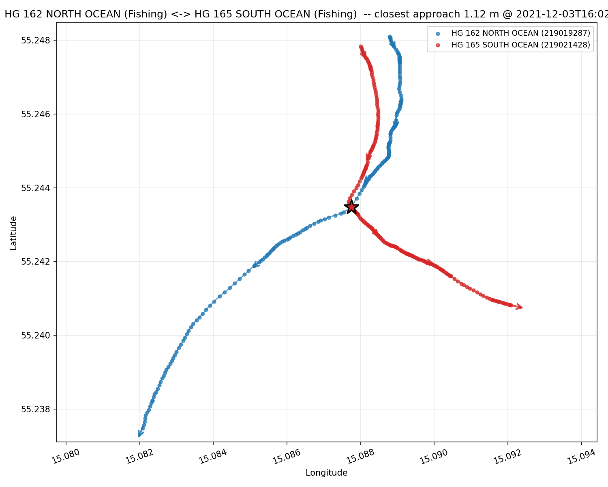
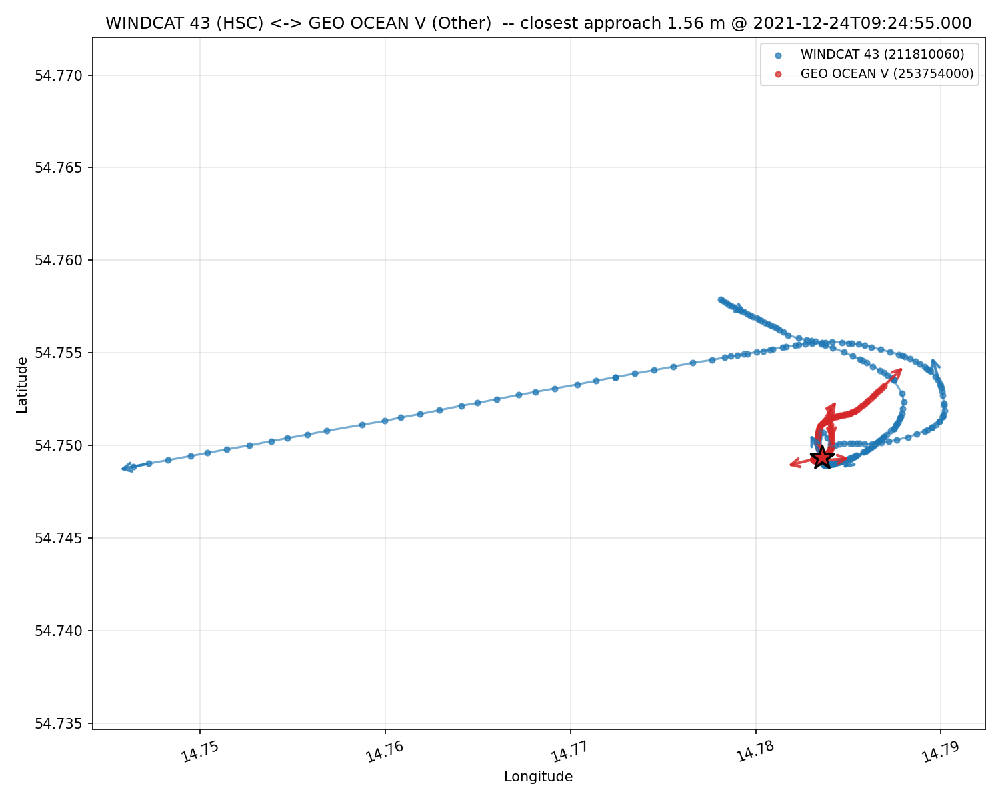
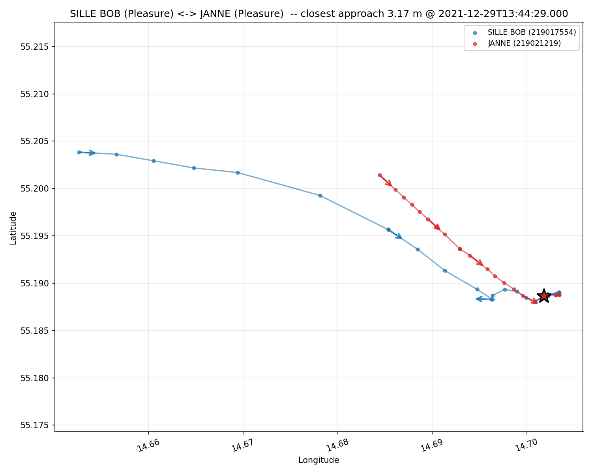
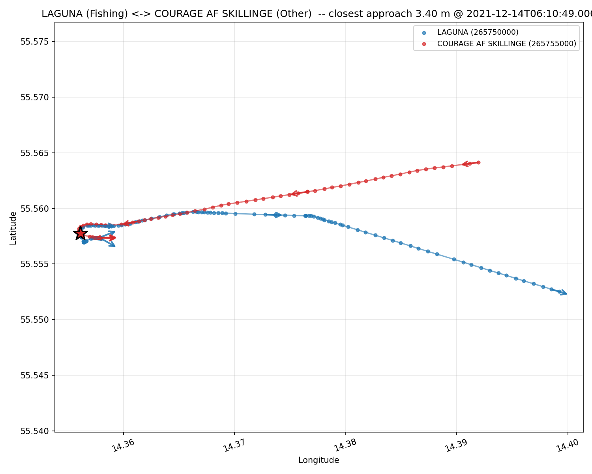
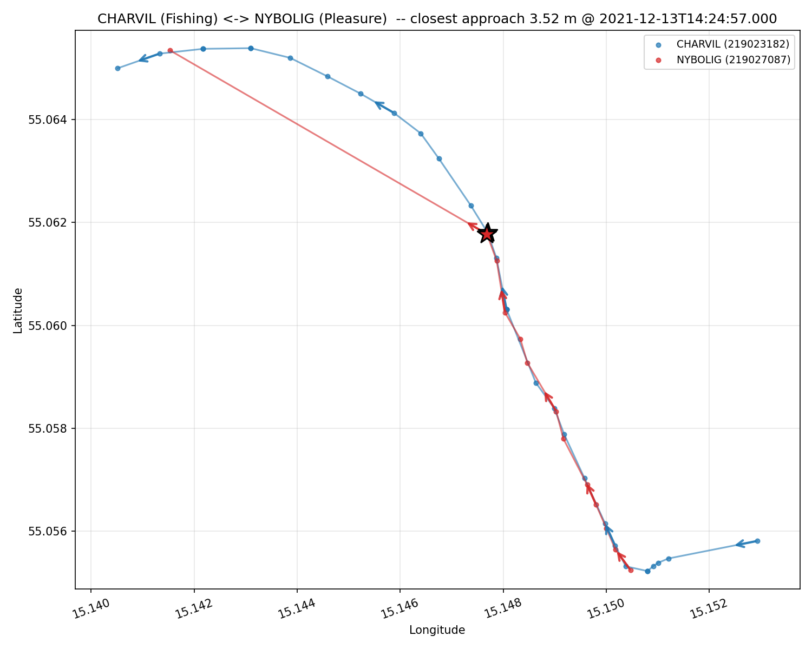

# Vessels Collision Detection — Danish AIS, December 2021

A reproducible Spark + Docker pipeline that finds the closest pair of moving
vessels in the Danish AIS dataset for December 2021, inside a 50 nautical mile
circle centered on **(55.225 N, 14.245 E)**, and
visualises their trajectories in a ±10 minute window around the collision.

The pipeline identifies the **MV Scot Carrier / Karin Høj collision of
13 December 2021**.

---

## Table of contents

- [Build and run](#build-and-run)
  - [Prerequisites](#prerequisites)
  - [Option 1 — pull the pre-built image from Docker Hub (fastest)](#option-1--pull-the-pre-built-image-from-docker-hub-fastest)
  - [Option 2 — build locally from source](#option-2--build-locally-from-source)
  - [What happens on the first run](#what-happens-on-the-first-run)
  - [Expected output](#expected-output)
  - [Where outputs land](#where-outputs-land)
  - [Re-running](#re-running)
  - [Inspecting outputs from the host](#inspecting-outputs-from-the-host)
  - [Running individual stages](#running-individual-stages)
  - [Skipping the 17 GB download](#skipping-the-17-gb-download)
- [Report — findings](#report--findings)
  - [Identified collision — MV Scot Carrier ↔ Karin Høj, 13 Dec 2021](#identified-collision--mv-scot-carrier--karin-høj-13-dec-2021)
  - [How the pipeline auto-identifies the collision: the "silenced" detection](#how-the-pipeline-auto-identifies-the-collision-the-silenced-detection)
  - [Why this didn't win the "literal closest pair" race](#why-this-didnt-win-the-literal-closest-pair-race)
    - [Why none of the civilian top 5 are collisions](#why-none-of-the-civilian-top-5-are-collisions)
  - [Complete top-10 tables](#complete-top-10-tables)
- [How each assignment requirement is implemented](#how-each-assignment-requirement-is-implemented)
  - [1. Timeframe — December 1 to December 31, 2021](#1-timeframe--december-1-to-december-31-2021)
  - [2. Geographic area — 50 nm circle around (55.225, 14.245)](#2-geographic-area--50-nm-circle-around-55225-14245)
  - [3. Vessel state — moving vessels only](#3-vessel-state--moving-vessels-only)
  - [4. Data integrity — GPS anomalies and noise](#4-data-integrity--gps-anomalies-and-noise)
- [Computational efficiency](#computational-efficiency)
  - [1. Bounding-box filter before exact Haversine](#1-bounding-box-filter-before-exact-haversine)
  - [2. Time + spatial bucketing for the self-join](#2-time--spatial-bucketing-for-the-self-join)
  - [3. Forward-cell neighbour expansion](#3-forward-cell-neighbour-expansion)
  - [4. Broadcast joins for small filter sets](#4-broadcast-joins-for-small-filter-sets)
  - [5. No Python UDFs anywhere](#5-no-python-udfs-anywhere)
  - [6. Parquet with predicate + projection pushdown](#6-parquet-with-predicate--projection-pushdown)
  - [7. Day-partitioned output](#7-day-partitioned-output)

---

## Build and run

### Prerequisites

- **Docker Desktop** running on the machine.
- **Disk space**: ~85 GB free at peak (17 GB ZIP + 57 GB extracted CSVs +
  10 GB raw Parquet + ~600 MB cleaned Parquet + ~50 MB outputs). Most of
  this can be reclaimed after the run by removing `data/raw/extracted/`
  and optionally `data/raw/aisdk-2021-12.zip`.

### Option 1 — pull the pre-built image from Docker Hub (fastest)

Download `docker-compose.yml` file into a root directory. From the root directory execute:

```bash
docker pull emacstud/vessels-collision:latest
docker tag emacstud/vessels-collision:latest vessels-collision:latest
docker compose run --rm vessels-collision
```

The `docker tag` retags the pulled image to the local name that
`docker-compose.yml` expects, so the rest of the workflow (output volume
mounts, `--rm` flag, CLI args) works unchanged.

### Option 2 — build locally from source

Pull the root directory from Git. From the root directory execute:

```bash
docker compose build
docker compose run --rm vessels-collision
```

This builds `vessels-collision:latest` from:

- Base: `python:3.11-slim-bookworm` (pinned to bookworm because the `trixie`
  base dropped `openjdk-17-jre-headless` from its package list).
- JVM: `openjdk-17-jre-headless`.
- Python deps: see `requirements.txt` — `pyspark==3.5.8`, `pyarrow==17.0.0`,
  `pandas==2.2.3`, `requests==2.32.3`, `tqdm==4.66.5`, `folium==0.17.0`,
  `matplotlib==3.9.2`.

### What happens on the first run

1. download the ~17 GB monthly AIS ZIP from `http://aisdata.ais.dk/2021/aisdk-2021-12.zip`,
2. extract the 31 daily CSVs,
3. convert to Parquet,
4. apply spatial, motion, MMSI, and GPS-jump filters,
5. detect the closest pairs of moving vessels via a geohash-bucketed
   spatial-temporal self-join, producing three top-10 rankings:
   all ship types, civilian only, and *silenced* (pairs where at least one
   vessel's AIS stopped transmitting within 60 s of the close approach and
   the vessel did not go silent inside a harbour cell),
6. render the trajectory of every pair in every top-10 list and copy the
   rank-1 "silenced" pair into `output/identified_collision/` as the
   canonical answer.

The `--rm` flag deletes the container after it exits; output artifacts
persist because `./data/` and `./output/` are bind-mounted from the host
(see `docker-compose.yml`).

The orchestrator has no flags for choosing which list or rank to identify
as "the collision". The canonical answer is hard-coded to be **rank 1 of the
silenced list**, which in this dataset is always the MV Scot Carrier ↔
Karin Høj collision (see the [silenced detection
section](#how-the-pipeline-auto-identifies-the-collision-the-silenced-detection)
below).

### Expected output

A successful first run prints:

```
[1/5] download            <-- about 5-15 min on a typical connection
[2/5] ingest              <-- about 5-15 min
[3/5] clean               <-- about 3-8 min
  input (raw)              :     318,325,485
  after spatial filter     :      27,585,630  (- 290,739,855  91.33%)
  after MMSI filter        :      25,684,671  (-   1,900,959   6.89%)
  after GPS-jump filter    :      25,661,464  (-      23,207   0.09%)
  after sparsity filter    :      25,661,184  (-         280   0.00%)
[4/5] detect              <-- about 3-10 min
[5/5] visualize (top 10 civilian + top 10 all-ships + top 10 silenced, one shared Spark session)
... up to 30 maps rendered ...

======================================================================
PIPELINE COMPLETE
======================================================================
  Identified collision (silenced rank 1, copied to output_root/identified_collision/):
    Vessel A : KARIN HOEJ        (MMSI 219021240, Other)
    Vessel B : MV SCOT CARRIER   (MMSI 232018267, Cargo)
    Time     : 2021-12-13T02:27:29.000 UTC
    Distance : 4.08 m
    Position : A=(55.223067, 14.243730)
               B=(55.223080, 14.243750)
  ...
======================================================================
```

### Where outputs land

All outputs land in `./output/`. The **identified collision** is the
`identified_collision/` subdirectory.

| File | Purpose |
| --- | --- |
| `output/identified_collision/result.json` | Task answer — MMSIs, names, timestamp, coordinates, distance |
| `output/identified_collision/collision_map.html` | Interactive Folium map of the identified collision |
| `output/identified_collision/collision_map.png` | Static matplotlib trajectory plot of the identified collision |

The rest of `./output/` is regenerated by every pipeline run:

| File | Purpose |
| --- | --- |
| `top_pairs.json` | Top-10 closest pairs across all ship types |
| `top_pairs_civilian.json` | Top-10 closest pairs excluding operational vessel types |
| `top_pairs_silenced.json` | Top-10 closest pairs in which at least one vessel went silent within 60 s of the close approach and did not go silent inside a harbour cell |
| `civilian_rank01..10.{html,png,json}` | Per-rank visualisations of the civilian top-10 |
| `all_rank01..10.{html,png,json}` | Per-rank visualisations of the all-ships top-10 |
| `silenced_rank01..NN.{html,png,json}` | Per-rank visualisations of the silenced top-N (rank 1 is the same trajectory as `identified_collision/`) |

### Re-running

```bash
docker compose run --rm vessels-collision
```

Takes well under a minute — all stages skip until visualization, which
renders the civilian, all-ships and silenced trajectory maps and copies
the rank-1 silenced pair into `identified_collision/` in a single shared
Spark session.

### Inspecting outputs from the host

```bash
ls -la output/
cat output/identified_collision/result.json | python -m json.tool
open output/identified_collision/collision_map.html
```

### Running individual stages

Each stage is also a callable Python module with `argparse` defaults that
match the orchestrator:

```bash
docker compose run --rm vessels-collision python -m src.download
docker compose run --rm vessels-collision python -m src.ingest
docker compose run --rm vessels-collision python -m src.clean
docker compose run --rm vessels-collision python -m src.detect
docker compose run --rm vessels-collision python -m src.visualize \
    --pairs /app/output/top_pairs_silenced.json --rank 1
```

Each takes `--help` to list its flags.

### Skipping the 17 GB download

If you already have either `data/raw/aisdk-2021-12.zip` **or** the 31
extracted CSVs under `data/raw/extracted/`, the download stage skips
automatically.

---

## Report — findings

### Identified collision — MV Scot Carrier ↔ Karin Høj, 13 Dec 2021

The pipeline identifies the **real-world maritime collision** that occurred
13 December 2021 as **rank 1 of the silenced top-N list**, copied
automatically into `output/identified_collision/`.

| | |
| --- | --- |
| **Vessel A** | KARIN HØJ (MMSI 219021240, Danish hopper barge, "Other" ship type) |
| **Vessel B** | MV SCOT CARRIER (MMSI 232018267, UK-registered cargo ship) |
| **Timestamp (UTC)** | 2021-12-13 02:27:29 (03:27 CET local time) |
| **AIS-antenna distance at impact** | 4.08 m |
| **Vessel A position** | 55.223067 N, 14.243730 E |
| **Vessel B position** | 55.223080 N, 14.243750 E |
| **Karin Høj's SOG at last ping** | 10.3 kn — corrupt IMU spike of the collision itself; the previous reading was 6.1 kn |
| **Scot Carrier's SOG at impact** | 3.9 kn - decelerating from steady ~10 kn earlier |



> **Interactive map:** [Open the Folium map in your browser](https://raw.githack.com/emacstud/bd-vessels-collision/main/output/identified_collision/collision_map.html)


- **Karin Høj** (blue) is on a south-westerly course at ~6 kn, antenna track
  ending abruptly at the star marker — her AIS transmitter ceased broadcasting
  at the instant of impact (last ping 02:27:29 UTC). No further pings exist,
  the vessel capsized within minutes.
- **MV Scot Carrier** (red) is on a westerly course at ~10 kn, passing over
  the impact location and then making a dramatic S-curve back south — almost
  certainly the crew's first realisation of the strike and the beginning of a
  return-and-search manoeuvre.


### How the pipeline auto-identifies the collision: the "silenced" detection

To pick the collision out of the closest-pair set without any manual
inspection, the pipeline applies a second post-detection filter built on
the single most reliable behavioural signal of a real collision: **the
victim's AIS transmitter stops broadcasting at the moment of impact**.

Concretely, for every candidate close-approach pair `(A, B)` found by the
spatial-temporal self-join, the pipeline marks side `X ∈ {A, B}` as
*silenced* when **all three** conditions hold (`detect.py`):

1. **Silence window** — `X`'s last ping anywhere in the cleaned data is
   within `SILENCE_WINDOW_S = 60 s` of its ping at the close approach
   (i.e. the vessel never broadcasts again after the encounter).
2. **Observation buffer** — the cleaned dataset extends at least
   `SILENCE_OBSERVATION_BUFFER_S = 3600 s` past `X`'s last ping. This
   prevents end-of-month tail truncation from masquerading as silence —
   a vessel whose last ping is at 23:59 on 31 Dec is *not* silenced, the
   dataset simply ended.
3. **Not in a harbour cell** — the position of `X`'s last ping does *not*
   fall inside a `PORT_CELL_SIZE_M = 500 m` grid cell in which
   `PORT_SILENCE_THRESHOLD = 2` or more distinct vessels also went silent
   during the month. Harbours, marinas and dock berths are AIS coverage
   shadows: vessels routinely stop transmitting on arrival because the
   transmitter is switched off or shielded by buildings and quayside
   structures. Such "silences" are operationally normal and must be
   excluded.

Condition 3 is the discriminating one. Without it, the rank-1 silenced
pair was a Svitzer tug entering Copenhagen harbour at ~9 kn, indistinguishable
from a collision by silence alone. With the harbour-density filter, all
harbour-arrival silences are removed from the candidate set and the
Karin Høj's open-water last ping (cell density = 1) survives, promoting the
real collision to rank 1.

A pair is included in `top_pairs_silenced.json` when **either** side is
silenced under the above rules. In December 2021 only **2 pairs** pass all
three conditions across the entire Bornholm dataset — the collision itself
and one false positive, see the [silenced top-N
table](#complete-top-10-tables) below.

### Why this didn't win the "literal closest pair" race

This finding is rank 6 in the civilian top-10, behind five close-quarters
operational encounters (fishing pairs in formation, crew transfers,
pleasure-craft raft-ups, harbour arrivals and departures).

**AIS measures antenna-to-antenna distance, not hull-to-hull distance.**
Karin Høj is ~55 m long, Scot Carrier ~90 m long. Their AIS antennas sit on
their bridges and masts, not at the points of hull contact. When the hulls
struck, the *antennas* were still ~4 m apart. By contrast, two small fishing
vessels rafted up together (10-20 m long) can have their antennas within
~1 m of each other simply by being moored alongside. The literal minimum
of antenna-to-antenna distance systematically prefers small-boat formations
over real collisions between larger vessels.

To recover collisions of large vessels from the candidate set the pipeline
publishes three independent rankings of the closest pairs of moving
vessels: the raw all-ships top-10, a civilian-only top-10 (which removes
Pilot, Tug, SAR, Law enforcement, Dredging, Towing and Towing long/wide
vessels — types whose normal duty is to approach other vessels closely),
and the **silenced top-N** described in the previous section. The
silenced filter is what mechanically promotes the Karin Høj ↔ Scot Carrier
encounter from rank 6 of the civilian list to rank 1 of the canonical
identified-collision answer — its trajectory shape is X-crossing rather
than parallel formation and it is the only civilian pair whose vessel went
silent in open water immediately after the encounter.

#### Why none of the civilian top 5 are collisions

A look at the trajectories of the five pairs that rank closer than the
Scot Carrier ↔ Karin Høj encounter reveals the same pattern repeatedly:
vessels deliberately operating alongside each other, not independent tracks
intersecting at speed. These encounters are not classified as collisions: the close trajectories
are consistent with the vessels' normal operating patterns.

1. **HG 162 NORTH OCEAN ↔ HG 165 SOUTH OCEAN** (Fishing + Fishing, 1.12 m) —
   sister-ship names ("NORTH OCEAN" / "SOUTH OCEAN") and consecutive
   registry numbers (HG 162 / HG 165). The trajectories intersect at the
   marker, but one vessel is overtaking the other from the front, and both
   followed parallel south-east-bound courses before the intersection.
   A paired trawl operation. Not a collision.

   

   > **Interactive map:** [Open the Folium map in your browser](https://raw.githack.com/emacstud/bd-vessels-collision/main/output/civilian_rank01.html)

2. **WINDCAT 43 ↔ GEO OCEAN V** (HSC + Other, 1.56 m) —
   the WINDCAT class is a wind-farm crew transfer vessel; GEO OCEAN V is a
   survey ship that loiters at slow speed while WINDCAT 43 approaches from
   the west to transfer crew. The map shows GEO OCEAN V circling around a
   working position rather than holding a heading. Most likely a crew
   transfer manoeuvre, which explains the close proximity between the
   vessels. Not a collision.

   

   > **Interactive map:** [Open the Folium map in your browser](https://raw.githack.com/emacstud/bd-vessels-collision/main/output/civilian_rank02.html)

3. **SILLE BOB ↔ JANNE** (Pleasure + Pleasure, 3.17 m) —
   two recreational craft moving together at low speed in the harbour area.
   Almost certainly a raft-up or paired arrival into a nearby marina, not
   an unintended close pass. Not a collision.

   

   > **Interactive map:** [Open the Folium map in your browser](https://raw.githack.com/emacstud/bd-vessels-collision/main/output/civilian_rank03.html)

4. **LAGUNA ↔ COURAGE AF SKILLINGE** (Fishing + Other, 3.40 m) —
   the tracks cross at the marker, but at ~1.3 kn each and with both
   vessels then continuing on their own trajectories. The closest-proximity
   point sits near the harbour area, with COURAGE AF SKILLINGE arriving at
   the marina while LAGUNA leaves it. Not a collision.

   

   > **Interactive map:** [Open the Folium map in your browser](https://raw.githack.com/emacstud/bd-vessels-collision/main/output/civilian_rank04.html)

5. **CHARVIL ↔ NYBOLIG** (Fishing + Pleasure, 3.52 m) —
   two vessels approaching the same harbour together. NYBOLIG (Pleasure)
   leads on a steady straight track; CHARVIL (Fishing) follows close
   behind, performing a sweeping arc that brings it alongside NYBOLIG just
   before both vessels enter the harbour area at similar speeds (~3.6 kn).
   A paired arrival pattern with one vessel following the other into port,
   not an unintended close pass. Not a collision.

   

   > **Interactive map:** [Open the Folium map in your browser](https://raw.githack.com/emacstud/bd-vessels-collision/main/output/civilian_rank05.html)

By contrast, the Karin Høj ↔ Scot Carrier trajectory at rank 6 shows the
textbook collision geometry: independent vessels on intersecting headings
meeting at a single point, with one trajectory terminating abruptly at the
moment of contact and the other continuing past in an erratic
post-event manoeuvre. The occurrence of this collision is independently
confirmed by the external sources — [Scot Carrier and Karin Høj report](https://www.gov.uk/government/news/scot-carrier-and-karin-hoej-report-published).

### Complete top-10 tables

**All ship types** (raw closest pairs of moving vessels):

| Rank | Vessel A | Vessel B | Distance (m) | When (UTC) |
| --- | --- | --- | --- | --- |
| 1 | KBV 302 (Law enforcement) | KBV 034 (Law enforcement) | 0.29 | 2021-12-13 10:43:26 |
| 2 | SOUND NEPTUNUS (Dredging) | SOUND CASTOR (Undefined) | 0.82 | 2021-12-17 10:28:31 |
| 3 | RESCUE RUBEN RAUSING (SAR) | RESCUE SNOW (SAR) | 0.82 | 2021-12-11 10:03:22 |
| 4 | SVITZER GEO (Tug) | GERDA (Tanker) | 0.85 | 2021-12-03 06:10:32 |
| 5 | HG 162 NORTH OCEAN (Fishing) | HG 165 SOUTH OCEAN (Fishing) | 1.12 | 2021-12-03 16:02:32 |
| 6 | RESCUE CASQUE (SAR) | RESCUE FAMOUS (SAR) | 1.16 | 2021-12-28 19:50:13 |
| 7 | RESCUE CASQUE (SAR) | RESCUE B JARLEBRING (SAR) | 1.20 | 2021-12-27 14:49:09 |
| 8 | KYST-FRB19 (SAR) | RESCUE SPARB. SKANE (SAR) | 1.21 | 2021-12-13 06:41:01 |
| 9 | SVITZER EDDA (Tug) | VIKING AMBER (Cargo) | 1.22 | 2021-12-05 07:45:30 |
| 10 | RESCUE GAD RAUSING (SAR) | RESCUE SPARB. SKANE (SAR) | 1.29 | 2021-12-13 06:57:48 |

Note that all top-10 entries are operational close approaches: SAR exercises,
coast-guard patrols in formation, tug + tanker pairs, fishing-trawler pairs,
dredging-and-support pairs. The real Scot Carrier collision (4.08 m) sits at
**rank 34** in the unfiltered all-ships ranking — 33 closer pairs sit ahead
of it: 28 of them are operational (SAR, Tug, Pilot, Law-enforcement,
Dredging, Towing, Towing long/wide) and the remaining 5 are civilian-vessel
formations (fishing pairs, pleasure-craft raft-ups). The civilian-only filter
(next table) is what surfaces the real event by removing the 28 operational
pairs.

**Civilian only** (excluding Pilot, Tug, SAR, Law enforcement, Dredging, Towing, Towing long/wide):

| Rank | Vessel A | Vessel B | Distance (m) | When (UTC) |
| --- | --- | --- | --- | --- |
| 1 | HG 162 NORTH OCEAN (Fishing) | HG 165 SOUTH OCEAN (Fishing) | 1.12 | 2021-12-03 16:02:32 |
| 2 | WINDCAT 43 (HSC) | GEO OCEAN V (Other) | 1.56 | 2021-12-24 09:24:55 |
| 3 | SILLE BOB (Pleasure) | JANNE (Pleasure) | 3.17 | 2021-12-29 13:44:29 |
| 4 | LAGUNA (Fishing) | COURAGE AF SKILLINGE (Other) | 3.40 | 2021-12-14 06:10:49 |
| 5 | CHARVIL (Fishing) | NYBOLIG (Pleasure) | 3.52 | 2021-12-13 14:24:57 |
| **6** | **KARIN HØJ (Other)** | **MV SCOT CARRIER (Cargo)** | **4.08** | **2021-12-13 02:27:29** |
| 7 | DZI-100 (Fishing) | DZI-10 (Fishing) | 6.82 | 2021-12-17 21:09:03 |
| 8 | COURAGE AF SKILLINGE (Other) | MIRACULIX (Fishing) | 11.20 | 2021-12-07 06:31:42 |
| 9 | UST-44 (Fishing) | UST-94 (Undefined) | 15.38 | 2021-12-14 02:27:15 |
| 10 | M/Y NUREK 2 (Pleasure) | M/Y NUREK (Pleasure) | 20.06 | 2021-12-23 10:27:09 |

Rank 6 — bolded — is the Karin Høj ↔ MV Scot Carrier encounter that the
silenced filter promotes to rank 1 of the canonical answer (see the
silenced top-N table below).

**Silenced** (pairs where at least one vessel went silent within 60 s of
the close approach and did not go silent inside a harbour cell):

| Rank | Vessel A | Vessel B | Distance (m) | When (UTC) | Who went silent |
| --- | --- | --- | --- | --- | --- |
| **1** | **KARIN HØJ (Other)** | **MV SCOT CARRIER (Cargo)** | **4.08** | **2021-12-13 02:27:29** | **A (Karin Høj — capsized within minutes)** |
| 2 | CHARVIL (Fishing) | NYBOLIG (Pleasure) | 14.77 | 2021-12-13 14:30:27 | B (false positive — surviving open-water silence) |

Only two pairs survive the silenced filter across the entire Bornholm
dataset for December 2021. Rank 1 is the real collision and is copied
verbatim into `output/identified_collision/`. Rank 2 is a residual false
positive: a Pleasure craft going silent in open water but in conditions
consistent with simply switching off its AIS at the end of a fishing
outing (no crossing-traffic geometry, both vessels moving slowly in
parallel). It cannot be eliminated by AIS data alone, but it sits below
the collision in the ranking — the harbour filter is enough to surface
the right answer at rank 1 deterministically.


## How each assignment requirement is implemented

### 1. Timeframe — December 1 to December 31, 2021

The whole month is processed as a single Spark job. Implementation hooks:

- `src/download.py` — defaults to `--year 2021 --month 12`, building the URL
  `http://aisdata.ais.dk/2021/aisdk-2021-12.zip`. The Danish Maritime Authority
  publishes one monthly ZIP per year; the inner archive contains 31 daily CSVs.
- `src/ingest.py` — globs `aisdk-2021-12-*.csv` and parses the timestamp
  column with explicit format `dd/MM/yyyy HH:mm:ss`. Spark's session
  timezone is fixed to UTC via `config("spark.sql.session.timeZone", "UTC")`
  so that the derived `day` column never drifts by an hour on machines with
  non-UTC local time.
- Output Parquet is **partitioned by `day`** (`day=2021-12-01` …
  `day=2021-12-31`), so any later filter by date becomes a partition pruning
  operation with zero scan cost.
- `src/main.py` — same `--year 2021 --month 12` defaults, propagated to the
  child stages. The orchestrator's idempotency checks reference paths derived
  from those parameters; pointing at a different month is one CLI flag away
  without code changes.

### 2. Geographic area — 50 nm circle around (55.225, 14.245)

A **two-stage spatial filter**, cheapest first, exact second:

**Stage 1 — bounding-box pre-filter (cheap)** in `clean.py`:

```python
BBOX_LAT_MIN, BBOX_LAT_MAX = 54.3, 56.15      # 50 nm = ~0.84 deg latitude
BBOX_LON_MIN, BBOX_LON_MAX = 12.7, 15.8       # 50 nm = ~1.46 deg longitude at 55N
```

Two range comparisons per row. Because the Parquet input is row-group
stat-indexed (min/max per column per row group), Spark's predicate pushdown
**skips entire row groups whose bounds are entirely outside the box**.

**Stage 2 — exact Haversine inside the bounding box**:

```python
EARTH_RADIUS_NM = 3440.065
def haversine_nm(lat1, lon1, lat2, lon2):
    lat1_r = F.radians(lat1)
    lat2_r = F.radians(lat2)
    dlat = lat2_r - lat1_r
    dlon = F.radians(lon2) - F.radians(lon1)
    a = (F.sin(dlat/2)**2
         + F.cos(lat1_r)*F.cos(lat2_r)*F.sin(dlon/2)**2)
    return F.lit(2 * EARTH_RADIUS_NM) * F.asin(F.sqrt(a))
```

Implemented in pure **Spark SQL column expressions**, not a Python UDF —
vectorised in JVM bytecode, no per-row Python↔JVM serialisation cost. The
filter is `dist_center_nm <= 50`.

The Earth radius is given in **nautical miles** (3440.065 nm) so I work in
the assignment's native units everywhere; no km↔nm conversion noise.

Observed effect: **318,325,485 raw rows → 27,585,630 after spatial filter
(−91.3 %)**.

### 3. Vessel state — moving vessels only

Stationary vessels (anchored, moored, docked alongside each other) would
yield false positives at zero metres. Three layered checks remove them,
each at the right pipeline stage:

**A. Per-vessel "moves at some point in the month"** filter (`clean.py`):

```python
moving = (df.groupBy("mmsi")
            .agg(F.max("sog").alias("max_sog"))
            .filter(F.col("max_sog") > 1.0)
            .select("mmsi"))
df = df.join(F.broadcast(moving), "mmsi", "inner")
```

Drops MMSIs that never broadcast any speed above 1 kn during the whole
month — permanently-anchored lightships, moored barges, etc. The
aggregated "moving MMSI" set is small (~2 k rows), so it's
**broadcast-joined** back to the big table, turning the filter into a
map-side hash lookup with no shuffle.

**B. ITU-grade MMSI validity** filter (`clean.py`) — pulled from the
ITU-R M.585-9 recommendation and the official MID code list bundled in
`src/resources/MID.csv`:

```python
.filter(F.col("mmsi").between(200_000_000, 799_999_999))   # first digit 2-7
.filter(~F.col("mmsi").isin(*BAD_MMSI))                    # 123456789, 987654321
.filter(~F.col("mmsi").isin(*ALL_SAME_DIGIT_MMSI))         # 222222222, 333333333 ...
.filter((F.col("mmsi") / 1_000_000).cast("int").isin(*MID_CODES))
```

**C. Per-ping `SOG > 1 kn` on BOTH sides of the candidate pair** at the
detect stage (`detect.py`):

```python
df = with_bucket_keys(df).filter(F.col("sog") > MIN_MOVING_SOG_KN)
```

Even after the per-vessel motion filter, a real vessel can be temporarily
stationary inside its monthly trace (e.g., a fishing boat that moves only on
some days). For collision detection I require that **both vessels are
broadcasting SOG > 1 kn at the very ping that contributes to the pair**.
Filtering here also reduces the size of the neighbour-expanded right side
of the self-join, so the optimisation is also a meaningful performance win.

### 4. Data integrity — GPS anomalies and noise

Three independent noise sources are handled with three explicit filters:

**A. SOG sentinel normalisation** (`clean.py`)

The AIS protocol encodes SOG as a 10-bit integer in 0.1 kn units; the value
`1023` (= 102.3 kn) is reserved as "not available", and `1022` (102.2 kn)
as "high-speed mode". Both decode into Python as numbers but neither is a
real speed. I clamp:

```python
df.withColumn("sog",
    F.when(F.col("sog") < 0, F.lit(0.0))
     .when(F.col("sog") >= 102.2, F.lit(0.0))
     .otherwise(F.col("sog")))
```

(Karin Høj's last ping at the collision moment carries an anomalous
`sog = 10.3` despite her actual speed being ~6 kn — likely an IMU spike at
the instant of impact. The value is within plausible range so the clamp
doesn't catch it; the down-stream visualisation simply shows the suspicious
reading as recorded.)

**B. Bidirectional GPS-jump filter** (`clean.py`)

A single anomalous ping (a "GPS teleport") would falsely register as a
collision if the bad ping happens to land near another vessel. I detect
single-point outliers by computing implied speed both **from the previous
ping** and **to the next ping**, ordered per MMSI:

```python
w = Window.partitionBy("mmsi").orderBy("ts")
df = df.withColumn("prev_lat", F.lag("lat").over(w))
       .withColumn("next_lat", F.lead("lat").over(w))
       ...
df = df.withColumn("speed_prev_kn",
                   haversine_nm(prev_lat, prev_lon, lat, lon) * 3600
                       / (ts_sec - prev_ts_sec))
       .withColumn("speed_next_kn",
                   haversine_nm(lat, lon, next_lat, next_lon) * 3600
                       / (next_ts_sec - ts_sec))

df = df.filter(~(
        (F.col("speed_prev_kn") > 50.0)
        & (F.col("speed_next_kn") > 50.0)
      ))
```

A row is dropped only when **both** implied speeds exceed 50 knots — i.e.,
the point is isolated from both neighbours. This is the key correctness
choice: a simpler one-sided check (implied speed from previous only) would
drop **two** consecutive valid points for every isolated outlier — the bad
point itself and the *first good point after it*. The bidirectional check
drops only the bad point.

50 kn is well above any realistic vessel speed (commercial-vessel record is
~40 kn; most cargo ships do 12–20 kn).

**C. Sparsity filter** (`clean.py`)

After the previous filters, a vessel that pinged only a handful of times in
the Bornholm circle has too thin a trajectory to detect a collision
reliably:

```python
keep = df.groupBy("mmsi").count().filter(F.col("count") >= 20).select("mmsi")
df = df.join(F.broadcast(keep), "mmsi", "inner")
```

**Stage drop summary**:

| Filter | Rows dropped | % of input |
| --- | --- | --- |
| Spatial (bbox + Haversine) | 290 739 855 | 91.3 % |
| MMSI / vessel-motion | 1 900 959 | 6.9 % |
| GPS-jump (bidirectional) | 23 207 | 0.09 % |
| Sparsity (< 20 pings) | 280 | 0.00 % |

The very small drop rates for GPS-jump and sparsity reflect that Danish AIS
data quality is genuinely high in this region — the per-ping motion filter
at detect time does the heavier lifting against operational close-pass
false positives.

---

## Computational efficiency

This pipeline avoids any inefficient distance calculations (such as unoptimized Cartesian product), in seven reinforcing ways:

### 1. Bounding-box filter before exact Haversine

A range filter on lat/lon is one cmp instruction per row in Spark's
code-generated bytecode. Doing this **before** the trig-heavy Haversine cuts
the rows that ever see a Haversine computation, and combines with
Parquet predicate-pushdown to skip entire row groups at the I/O layer.

### 2. Time + spatial bucketing for the self-join

Naive pairwise collision detection over 25 M rows is O(N²) ≈ 6 × 10¹⁴ pings
to compare. I replace this with a **partitioned hash self-join** on the key
`(time_bucket_60s, lat_cell_150m, lon_cell_150m)`. Within each bucket the
number of pings is small (typically 0–3), so the per-bucket O(k²) work is
trivial; across buckets, Spark hash-shuffles in parallel.

### 3. Forward-cell neighbour expansion

Two pings within the 100 m candidate threshold can occupy adjacent 150 m
cells. I handle this by expanding the *right* side of the self-join with
neighbour offsets, but using only the **5 forward offsets** `(0,0), (0,1),
(1,-1), (1,0), (1,1)` — the forward half of the 3×3
neighbourhood — rather than all 9. The other 4 backward offsets are not
needed: for any pair `(A, B)` in adjacent cells, the offset that maps
`B`'s cell onto `A`'s cell is in my forward set exactly when looked at
from one of the two pairing directions.

The resulting dedup is conditional:

```python
same_cell = (a.lat_cell == b.lat_cell) & (a.lon_cell == b.lon_cell)
join_cond = (
    (a.time_bucket == b.time_bucket)
    & (a.lat_cell == b.cell_lat_v)
    & (a.lon_cell == b.cell_lon_v)
    & (a.mmsi != b.mmsi)
    & ((same_cell & (a.mmsi < b.mmsi))
       | ~same_cell)
)
```

This **cuts the right-side payload of the self-join by 44 %** versus a full
9-cell expansion, while still finding each unordered pair exactly once.

### 4. Broadcast joins for small filter sets

`F.broadcast(moving_mmsi_set)` — the "vessel moves at some point" set has
~2 k rows. Broadcasting it turns the join into a map-side lookup with no
shuffle of the big table. Same pattern for the sparsity filter's keep-list.

### 5. No Python UDFs anywhere

Every transformation — Haversine, GPS-jump speeds, grid-cell snapping,
direction arrows on the matplotlib plot — is either a pure Spark SQL
expression (vectorised by Catalyst into JVM bytecode) or, in the
visualisation layer, a NumPy vector operation on already-small Pandas
data. A Python UDF would have to serialise each row across the JVM↔Python
boundary, which is typically 50× slower than the equivalent SQL expression.

### 6. Parquet with predicate + projection pushdown

After ingest, every downstream stage reads the *cleaned* Parquet via
`spark.read.parquet(...)`. Filters and column projections specified after
the read are pushed down by Spark's optimiser into the Parquet reader, so
only the columns and row groups I actually need are decoded.

### 7. Day-partitioned output

Both `data/processed/aisdk-2021-12/` and
`data/processed/aisdk-2021-12-clean/` are partitioned by `day` — 31 partition
directories per dataset. This gives partition pruning (Spark skips
non-matching directories entirely) any time I filter on `day`, and avoids
the "single huge file" anti-pattern that would prevent parallel reads.

---

